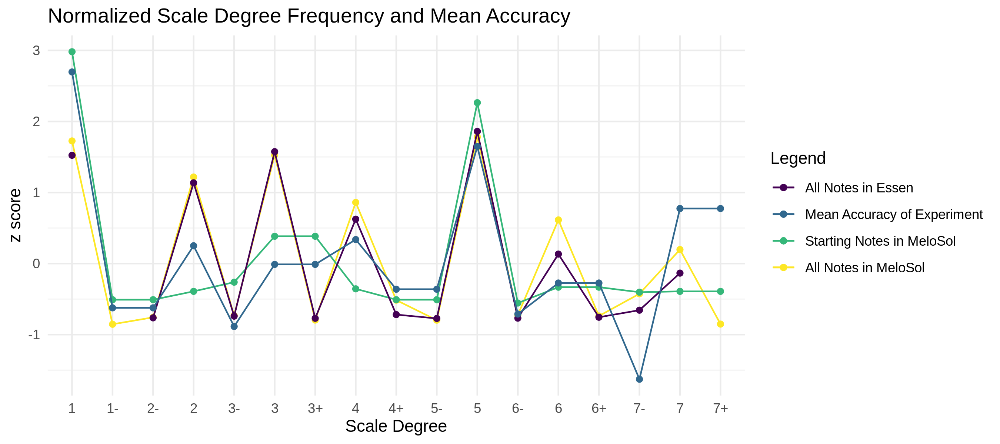
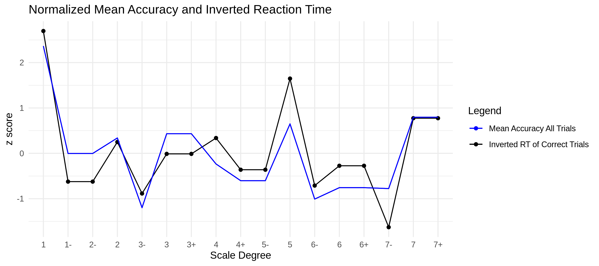

```{r setup, include = FALSE}
library("papaja")
r_refs("r-references.bib")
#r_refs("literature-references.bib")
```

Memory for music continues to present a paradox. 
As noted by @Halpern2010-cz, listeners are very good at recognizing melodies once encoded in long term memory, but are very poor at encoding melodies. 
Understanding exactly why this paradox exists becomes even more difficult because literature on memory for melodies tends to skew towards research that examines behavioral responses to entire melodies once they are encoded, as opposed to capturing the encoding process while melodies are being learned. 
Although thoroughly understanding both sides of this paradox is necessary to arrive at a comprehensive understanding of musical memory, a void in our collective understanding of melodic memory exists when examining how small scale musical structures are learned and what musical features contribute to that process. 
This study presents novel research to address this problem. 

## Melodic Memory

Listeners are generally very good at recognizing melodies; once encoded, listeners excel at melodic recognition. 
Regardless of a melody’s features such as its key, tempo, and timbre, a listener is able to remember and recognize a melody after brief exposures ranging from minutes and days [@Schellenberg2015-jh] to extend across a lifetime [@Bartlett1980-fc; @Rubin1998-pp].
Once melodies have been encoded, they do not behave like numbers or images in that they are resilient to any sort of memory interference effects, a finding that has been attributed to the multiple ways in which a listener might internally represent melodic information [@Herff2018-ts].  
Familiar melodies tend to be recognized quickly, as demonstrated by various note-by-note gating recognition paradigms with recognition typically established after hearing five to six notes [@Bailes2010-nh; @Bella2003-cy; @Daltrozzo2010-yn]. 
Even faster recognition of more ecologically plausible music has been demonstrated using audio data with accurate response levels recorded at the millisecond level [@Krumhansl2010-ws]. 

Further, research incorporating the modeling of musical memory with computational tools suggests that listeners do not rely on any set of independent features, but rather take a “holistic” approach when accounting for factors that contribute to a melody’s recognition [@Schulkind2003-je], with more recent work proposing that separate features of melodies contribute to distinct implicit and explicit learning processes [@Mullensiefen2014-ta]. 
Work on earworms in popular music has also linked musical features such as global and local measures of contour, tempo, and tonality [@Mullensiefen2009-dx] relating to better memorability [@Jakubowski2017-pz]. 
Taken together, modeling human memory using computational features suggests a clear rejection of any null hypothesis that would assume that all melodies are equally likely to be remembered, a position initially investigated by Ortmann in the early 20th century [@Ortmann1933-ty] and invites further investigation into this process.
Even individuals with reduced memory function from degenerative conditions such as Alzheimer’s disease demonstrate accurate levels of identifying differences in familiar and unfamiliar melodies [@Barlett1995-iw]. 
Once we know a melody, we don’t tend to forget it. 

In contrast to being very good at recognizing melodies, most people are not very good at learning melodies. 
Compared to other mediums like memory for visual art [@Standing1973-ou] that report nearly unlimited memory for visual items, memory for musical material tends to be far worse with levels of recognition scoring just above chance [@Dowling2008-oz; @Halpern2008-vh; @Halpern2010-cz] in paradigms that require the recognition of melodies after short time frames. 
In contrast to many other phenomena in music perception that exhibit some sort of dose-response effect, discriminatory memory for melodies does not consistently increase with musical training [@Halpern2010-cz; @Korenman2004-zu; @McAuley2004-eq], with some exceptions  [@Harrison2017-us]. 
Given most listeners' general poor ability to learn melodies, some psychometric music batteries such as the perceptual components from the Goldsmiths Musical Sophistication Index incorporate melodic discrimination paradigms without concern of any ceiling effects in performance [@Mullensiefen2014-kl]. 
While the above studies have brought us closer as a community to understanding some of the paradox of musical memory--- with insights recently brought forward via various computational methods--- methodological limitations often are only able to capture the presumed encoding of an entire melody at the macro level, not the process in which smaller level musical structures are encoded and thus cannot lend insight into explaining melodic memory at the micro level. 

## Recognition and Recall 

One of the reasons for this lack of understanding might be attributed to the fact that the musical memory literature tends to be dominated by recognition, as opposed to recall experiments. 
In contrast to recognition memory experiments-- where participants indicate whether or not they remember hearing a musical probe-- recall paradigms require participants to remember an exact, explicit entity when probed. 
As noted by @Halpern2010-cz, recognition paradigms tend to be favored by the music perception literature as they suffer from less issues related to production competence, which in turn allow for easier recruitment of participants from the general population. 
While recognition memory experiments tend to be favored in the literature, employing the level of expertise of a generalist listener comes at the expense of not being able to analyze smaller musical structures that are able to help answer questions of encoding. 
Unlike remembering letters, numbers, or patterns like those used in some recall tasks [@Unsworth2005-tz], recalling musical elements, such as individual notes, restricts the individuals who are eligible to participate in these studies. 

Despite the difficulties in design, there has been some work investigating recall for tones. 
For example, perception studies that have used recall paradigms with tones as stimuli often employ spatial metaphors that require participants to recall material at a more coarse level, such as indicating if tones were low, middle, or high [@Li2013-my; @Williamson2010-dw] or employ a precision-accuracy design [@Clark2018-mr].
Though these studies implement recall designs, the use of non music-theoretic response categories consequently does not allow for any sort of meaningful music theoretic analysis. 
Further, the goal of many of these studies is to use auditory stimuli to study individual differences, rather than favor a paradigm designed to understand structural properties of music that link the statistical properties of musical structure to aspects of musical perception [@Krumhansl2001-nq]. 

Finally, recognition designs that allow for more inclusive sampling via using tasks that employ a forced decision cognitive model [@Harrison2017-us] tasks often fail to control for more domain-general mechanisms like working memory capacity [@Cowan2010-zc].
Working memory capaciity might better account for individual variation in performance on tasks that require both the retention and active manipulation of musical material in memory [@Berz1995-lu].
Recent evidence has corroborated this claim [@elliott2021].

Some studies on musical recall have been able to avoid the above problems by relying on conducting experiments with individuals with formalized Western conservatory training by using a melodic dictation paradigm [@Karpinski2000-qz; @Ortmann1933-ty]. 
Melodic dictation is the process in which an individual hears a melody, then without access to any sort of reference, must transcribe the melody in musical notation, often within a short time span. 
While many melodic dictation studies are designed in a way that would lead to better understanding of musical recall, studies involving melodic dictation tend to have more ecological end-goals in the context in of musical education for understanding best practices in classroom settings [@Buonviri2014-ch; @Buonviri2015-qe; @Buonviri2017-gp]  or musical features responsible for differences at the individual level [@Pembrook1986-cg; @Taylor1983-uc].

Though the end goals of much of the melodic dictation literature purport to be  different to the memory for melodies literature, the skill set required in to carry out a melodic dictation could provide a valuable resource to help understand how melodies are encoded. 
As noted previously, one of the greatest methodological difficulties in investigating how melodies are encoded is that the general population lacks any sort of explicit language to collect responses in musical recall tasks. 
In isolation, the only individuals able to create meaningful response categories at the level of the individual note would be people with absolute pitch, the ability to identify and name musical tones [@Levitin2019-sb]. 
That said, tonal musical listening does not happen in isolation; tonal music is often described as having a hierarchical structure, individuals often hear musical tones in relation to a global tonic [@Krumhansl2001-nq; @Lerdahl2004-xc; @Meyer1956-gc] and much of the earlier research on melodic memory takes listeners’ ability to generalize melody through transposition as its stepping off point [@Dowling1978-ql]. 

Learning how to hear and identify these global relations is a fundamental skill taught to many students in North America as part of their ear training classes when pursuing a degree in music from schools accredited by the National Association of Schools of Music [@Nasm2019-fs]. 
Via the use of learning relative pitch solfege and the use of solmization, listeners learn to hear pitches as related to a global tonic, thus linking their phenomenological experience with the tone they are hearing to a larger tonal network of pitches [@Arthur2018-my], further allowing them to draw on their music theoretic knowledge to label tones with meaningful categories at the micro level [@Karpinski2000-qz]. 
Given this technique of being able to hear and identify musical pitches, individuals with relative pitch afford the ability to capture data in musical recall experiments that are meaningful while simultaneously capturing the encoding process.
This combination of skills could ultimately provide a novel way into investigating mental effort and other cognitive processes related to tonal cognition. 
Collecting data from a serial recall task with musically meaningful items will result in a robust dataset that will allow investigation into short term musical encoding and the features associated with memory performance.

## New Frameworks

Given a musical recall task with musically meaningful response categories, which claims from music perception could be further investigated? 
First and foremost, music recall at the note level can be used as a novel way to investigate claims about the limits of musical memory. 
For example, as noted by @Karpinski2000-qz in reviewing previous literature on melodic dictation, authors like @Marple1977-pm  claim the limits of musical memory to be “within the expected limit for short term memory as defined by Miller”, while both Tallarico, Long, and Pembrook all claim the limit of musical memory to be within seven and eleven notes [@Long1977-re; @Tallarico1974-mx; @Taylor1983-uc]. 
These researchers follow in the theoretical tradition of @Miller1956-np when they attempt to substitute the concept of seven plus or minus two _items_ for its musical analouge of _notes_.^[Using a serial recall task with musicall meaningful categories also affords a deeper investigation into the assumption and plausibility of switching the idea of an item for a note. While claims regarding this assertion translate Miller’s idea of an item to a musical note seem like a plausible logical extension of the work of Miller and other researchers within the field of working memory, we highlight that making an “items for musical notes'' substitution in this theoretical framework violates many of the pitfalls to be avoided in research that investigate the limit of short term or working memory [@Cowan2005-vx]. As noted by @Baker2019-ij, the use of musical tones as stimuli in musical recall tasks violates every warning put forward by Cowan (2005) and would thus would be a serious confound. While it would be possible to try to create a sample space that treated each item or note as independent, tonal music within classical and popular genres is almost by definition is both sequential and hierarchically organized. Thus, each note (item) does not exist in memory as an independent entity.]
A musical recall task could more clearly establish this claim and how variability in performance on this task is related to both individual differences and musical features.  

Secondly, using a serial recall task can serve as a medium to investigate the extent that computationally extracted features [@Jakubowski2017-pz; @Mullensiefen2009-dx; @Mullensiefen2014-ta; @Schulkind2003-je] are predictive of musical recall, as opposed to recognition, linking the structure of a melody to aspects of memory. 
Being able to collect data at the level of note, rather than summarizing performance after hearing a melody, allows researchers to model other possible theoretical claims put forward by the music perception literature ranging from statistical learning [@Huron2006-ly; @Pearce2018-lb], to the effects of contour [@Bartlett1980-yv], and tonalness [@Eerola2009-qj] on musical memory processing, and create models that explain performance on musical recall, as opposed to recognition, tasks. 
For example, a serial recall dataset could be used to model where in a melody notes are most likely to be recalled correctly or incorrectly. 
This could be used to further investigate claims of primacy and recency effects, as well as contour variation.  

Lastly, there are also theoretical insights that can be explored using musical recall tasks. 
For example, there currently exists rationale for using computational measures to model aspects of musical cognition [@Pearce2018-lb] when memory is conceptualized as compressibility [@Eerola2009-qj] using information content frameworks. 
For example, Pearce and Mullensiefen found that measures of compressibility can be used as predictors of musical similarity [@Pearce2017-rr] and work using symbolic summary features has additionally been successful at modeling musical memory using computational measures of complexity [@Baker2017-nt; @Bartlett1980-yv; @Cuddy1976-dk; @Cuddy1981-ha; @Harrison2017-us]. 

While some might argue that the relationship between compressibility and musical memory rely on too literal a metaphor of brain-as-computer, these theories, when considered in tandem with literature from cognitive psychology and theories of processing fluency, could offer explanatory insights into musical memory. 
For example, as discussed by @Huron2006-ly in his interpretation of the Hick-Hyman hypothesis [@Hick1952-mj; @Hyman1953-xw], Huron notes that “processing of familiar stimuli is faster than processing of unfamiliar stimuli (p. 63)”. 
If this is true, then computational models of music perception designed to capture statistical learning [@Pearce2005-hb; @Pearce2018-lb] should then be able to capture this claim of processing fluency. 

Series of notes that are more expected, due to relatively higher occurrences in a corpus reflecting a musical system of understanding, will have lower amounts of information content associated with those musical events and will be easier to recall. 
The reverse also would then hold true: more unexpected musical events will have a higher information content and if conceptualized as a proxy for memory, would be harder to retain in working memory and then recall. 
Work in improvisation has provided some evidence that “easier” patterns have some privileged position in empirical data investigating jazz solos and provide peripheral support linking the musical patterns to measures of processing fluency [@Beaty2020-uu].

Findings using a computational model such as the Information Dynamics of Music [@Pearce2005-hb; @Pearce2018-lb] might provide further theoretical clarity as to why computational measures of entropy often are predictive in behavioral contexts [@Agres2018-dw; @Loui2008-zy; @Loui2009-sr]. 
Incorporating a computational model of statistical learning also circumvents the note-for-item independence problem discussed in the prior footnote. 
A short musical pattern’s information content will reflect the sequential nature of tonal music and could serve as a novel framework to model musical chunking and help better understand and model the capacity limits of music and working memory. 
There has already been work demonstrating that information content can serve as a helpful demarcator at phrase boundaries [@Pearce2010-mw] warranting further investigation into modeling segmentation with information content as it pertains to chunking. 

## Hypotheses 

This paper presents a recall experiment using musically meaningful stimuli in a population of individuals trained in relative pitch to investigate musical memory. 
By using individuals trained in a moveable-do system, we designed and implemented a musical recall paradigm where, if an individual can establish a tonal center, individuals can recall single or multiple items akin to musical n-back tasks used in short term memory research [@Kane2007-pt]. 
In order to investigate claims of statistical learning and establish ecological validity, stimuli for this experiment were specifically sampled from a corpus of n-grams from a novel corpus. 
The _MeloSol_ [@Baker2020-pw], a 783 melody set of digitized melodies from the Fifth Edition of “A New Approach to Sight Singing” [@Berkowitz2011-hi], served as a population from which n-grams were pseudo-randomly selected from in order to represent the latent understanding of the listener. 
Here we explicitly assume that more frequently occurring patterns in the _MeloSol_ corpus can be used as a proxy to represent more frequent exposure to a musical pattern throughout a listener’s listening history. 
Support for using the _MeloSol_ corpus, rather than the larger and more often used _Essen Folk Song Collection_ [@Schaffrath1995-ci] can be found in @Baker2020-pw.  

In order to guide this analysis, we explore three claims as discussed above in order to provide novel insights into literature on memory for melodies. 
The first hypothesis (H1), explores claims of processing facilitation as they relate to previous exposure. 
In line with theoretical grounds established by @Huron2006-ly, @Pearce2018-lb, and discussed by @Baker2019-ij, we predict that more frequently occurring musical patterns will be recalled both more accurately and more quickly in relation than less frequently occurring patterns. 

We model frequency of occurrence based on three computational measures proposed in the literature thought to reflect a listener’s latent understanding of musical systems. 
This includes unigram frequency distributions of scale degrees from all notes within the _MeloSol_ corpus in line claims of @Krumhansl2001-nq, unigram frequency distributions of the starting notes of melodies as proposed by @Huron2006-ly, and unigram distributions of the _Essen Folk Song Collection_ [@Schaffrath1995-ci]. 
We model this claim using reaction time and accuracy from the serial recall experiment with responses to a single tone.

In the multiple tone conditions, where participants recalled two or more tones, we adopted a regression modeling approach. 
We first present an exploratory analysis to model the extent that univariate computational features are able to explain participant responses). 
We explore the number-of note-model [@Long1977-re; @Marple1977-pm; @Tallarico1974-mx], computational measures from the FANTASTIC toolbox relating to contour, tonality, and pitch and interval entropy [@Mullensiefen2009-dx], and various permutations of the Information Dynanmics of Music (IDyOM) model designed to capture mechanisms of statistical learning [@Pearce2005-hb; @Pearce2018-lb] that take advantage of a multiple-viewpoint framework [@Conklin1995-qk].
This analysis constitutes our second hypothesis (H2).

Finally, we then utilize a hierarchical regression framework to model behavioral responses in accuracy of responses using both individual and musical data.
Following the theoretical predictions put forward above, our third hypothesis (H3) would predict that measures associated with information content --reflecting a computational measures for processing fluency-- will outperform both rule based models based on the number of notes. 
The experimental materials and data are openly available on the Open Science Framework (OSF) for replication, future modeling, or extensions of this line of research (https://osf.io/a462v/).

# Methods

## Design 

This experiment utilized a within-subjects design that required participants to perform a serial recall task and were asked to recall either 1, 2, 3, 5, 7, or 9 different musical tone(s) in moveable-do solfege after hearing a piano establish a tonal center. 
The independent variables collected were those taken from the demographic survey listed below in Materials as well as sets of computational measures derived from the computational models.
Scripts to reproduce these analyses can be found in the supplemental materials. 

Dependent variables measured were accuracy, which was scored at the item level, as well as reaction time measured in milliseconds. 
A small pilot experiment was run (N = 11) in order to establish the difficulty of the task and investigate for any main effects of key in the single tone condition. 

## Participants

Participants for this study were recruited online to partake in the study hosted via Amazon Web Services after being advertised on social media using platforms such as Twitter and the SMT-Music Theory Pedagogy List-Serv. 
The sample consisted of 39 participants (Mean Age = 30.53 , SD = 10.22 , Range = 18 -- 64 ) consisted of 25 men, 13 women and 1 non-binary individual.
Ethical approval for this experiment was approved by the Louisiana State University Internal Review Board.

## Procedure

Participants accessed the experiment via a link to an internet browser. 
The first page of the study asked participants to use a desktop computer rather than a mobile device to complete the experiment and was only checked via a post-experiment questionnaire. 
Before collecting data, participants consented to the study as approved by the Louisiana State University Internal Review Board and were told in this experiment they would be asked to “listen to small musical excerpts then respond based on what you hear” as well as provide demographic information when recruited. 

The participants then answered six questions regarding their background: 

* How many years old are you? 
* What is your educational status? 
* Which type of syllable system do you prefer to use? 
* Do you have absolute pitch? How many weeks of aural skills training have you completed? 
* How many years have you taught aural skills at the post-secondary level? 

All responses were given as free text response. 
None of the demographic information is used in the analysis presented here, but was collected for exploratory data analysis as the basis for future work.
Next, participants were instructed on the task they were to complete and read the following text: 

> In this experiment you will complete the same task over many trials. In each section, you will hear a short cadence played on the piano followed by one or more musical tones. After hearing the tone or tones, you will be asked to respond which tone(s) you heard in moveable do notation as quickly and accurately as possible. There will be SIX blocks in this experiment, each corresponding to the number of tones you are asked to recall. This way, you will always know how many tones you need to respond with.

Participants then heard two examples with the answers provided. 
The first in which “Do” or scale degree 1 was the correct answer in the key of C major and the second where “Le” or scale degree b6 was the answer in the key of A major. 
Upon confirming they understood the task, participants then read the following prompt:

> The experiment consists of SIX blocks where you will be asked to recall either 1, 2, 3, 5, 7, or 9 notes in a block. As the sequences of notes get longer, please do your best even though you may not be able to perfectly complete the task. In each block, you will be asked to remember the same number of items. Please feel free to sing to yourself to figure out what the notes are. We encourage you to use headphones, but please report at the end of the experiment what you did listen with. When the entire experiment is over, you will be asked to report on strategies you used to complete this task. Trials are limited to 20 seconds, so the maximum amount of time it will take to complete this experiment given that there are SIX blocks is 25 minutes. Thank you very much for your time!

Participants then completed a block with one tone (played in three different keys: C, E, A Major) which consisted of 39 separate trials (13 notes including octave * 3 keys) then were given a break before beginning the two-tone condition. 
Participants heard 10, 9, 8 , 7 and 7 tones in the 2, 3, 5, 7, and 9 tone conditions respectively. 
In the multi-tone condition, participants recalled each tone as a separate screen according to the serial position they were recalling as depicted in Figure 1. 
If participants took over 20 seconds to respond per tone, the experiment moved to the next complete trial. These failed attempts were subsequently excluded from the analysis.

After completing all blocks, participants were asked six debriefing questions: 

* What strategies did you use to complete this task? 
* Do you have any opinions or thoughts you would like to share about this experiment? 
* Did you use any external reference (like playing on a piano) to help you figure out the answers? 
* Were you using headphones or listening through your computer speakers? 
* What is your gender? 
* Is this your first time taking this experiment? 

The experiment can be run from the online repository by navigating to the `experimental_materials/` directory in the repository and running `index.html` in a web browser.

## Materials

This study was implemented using jsPsych [@De_Leeuw2015-bl]. 
Stimuli for the experiment were selected by searching the _MeloSol_ corpus using the context command in humdrum [@Huron1994-gt] with the data tokenized using the ```deg -a``` command in looking for all grams. 
Each count of n-grams was then partitioned into five quintiles and n-grams were pseudo-randomly selected from each quintile. 
Pseudo-random selection was done by first randomly sampling three n-grams from each quintile, then adding in extra “easier” options at the discretion of the first author based on their pedagogical experience. 
This was done at the recommendation of the pilot experiment where many of the participants reported fatigue effects with even the single tone condition due to the relative difficulty of the task. 

After selection, stimuli were encoded using MuseScore to be played following a I - IV - I - V7 - I cadence played on the piano with closed voicings in half notes with the quarter note set to 120 BPM. 
After two beats of silence following the final tonic chord, the tones were then played as isochronous quarter notes. 
Recording of reaction time began only at the downbeat once the stimuli finished playing. 
For example, in the single tone condition, participants had to wait 3 beats (1.5 seconds) before they were able to respond. 
No floor effects of reaction time were observed in either the pilot data or the experimental data. 

## Computational Measures

Features were computed for each stimulus using the FANTASTIC toolbox [@Mullensiefen2009-dx] which computes a summary score for monophonic melodies with three or more notes. 
Information content as derived via an IDyOM model [@Pearce2005-hb; @Pearce2018-lb] was computed by first training an IDyOM model on a subset of 767 melodies from the _MeloSol_ corpus.
The output from the IDyOM model was then queried for each occurrence of the n-grams used in the stimuli, where the cumulative information content of each of the n-gram’s occurrence was calculated and then all averaged. 

Three separate IDyOM models were run with MIDI pitch number (`cpitch`) as the target view point. 
The first predicted the MIDI pitch number (`cpitch`) with the chromatic pitch interval view point  (`cpint`), the second predicted MIDI pitch number (`cpitch`) with the chromatic interval from tonic view point (`cpintfref`), and the third predicted MIDI pitch number (`cpitch`) using a combination of the both the chromatic interval (`cpint`) and chromatic interval from tonic view point (`cpintfref`). 
The dataset created via the IDyOM models was used to calculate the unigram scale degrees used in H1’s analysis of starting notes following @Huron2006-ly. 

# Modeling

Data from this experiment are reported following the three hypotheses listed above.

* H1: Scale degrees that occur more frequently in a musical corpora will be recalled more accurately and quickly than less frequently occurring musical patterns. 
* H2: Exploratory analysis demonstrating computationally derived features can explain variance in response data beyond chance levels in multi-note conditions.  
* H3: Features derived from measures of information content will outperform a “number of note” model when modeling response data using mixed effects, hierarchical regression analysis. 

All statistical analyses were done with the R programming langauge [@R-base].

### Data Cleaning and A Priori Assumptions

Participants were to be excluded from this study if they performed at chance levels in the single tone condition. 
Chance level performance was taken to be indicative that participants did not have the prerequisite skills in order to partake in the experiment. 
No participants were excluded from the study. 
When p values are reported, we adopt the p < .05 threshold in order to report findings as statistically significant.

## Hypothesis I

In order to examine the hypothesis that more frequently occurring musical notes will be recalled more accurately than less frequently occurring notes we adopt the following operationalizations. 
We define accuracy as the average percent of tones that were correctly identified across a participant’s trial. 
Response time was measured in milliseconds to respond as measured by the jsPsych plugin. 
Frequency of occurrence is modeled using unigram distribution frequency of occurrence in the MeloSol corpus, unigram frequency of starting notes in the _MeloSol_ corpus following @Huron2006-ly, and unigram frequency distribution of the European subset of the the _Essen Folk Song Collection_ [@Schaffrath1995-ci]. 

Correlations between average accuracy and the three measures of frequency of occurrence assuming octave invariance are reported below with their frequency of distribution displayed in Figure 1. 
Scale degree response across all three keys (A, C, E) did not show any main effect of key F(2, 35) = 0.395, p > .05. 
The non-significant result was also found in the pilot experiment and justified using the single key of C major throughout the multi-tone condition. 
Correlations reported are Spearman rank order. 
All scale degrees are reported in this analysis even though the experimental paradigm only consisted of a major key prime.

```{r}

```

Following the single tone condition, we report a significant Spearman rank correlation with the unigram distribution of scale degrees with mean accuracy and all corpora. 
Tests reported assumed a direction hypothesis with all values being positively correlated.

Mean accuracy correlated with All Note collection of the _MeloSol_ rs(13) = .458, p = 0.028, Starting note collection of the _MeloSol_ rs(13) = .616, p  = .003 , and the All Notes Collection of the _Essen_ rs(13) = .631 , p = .004. 
The corpora calculations also correlated with themselves, with the _Essen_ All Note Collection correlating with both the All Note _MeloSol_ rs(13) = .95, p  < .001 and the Starting Note _MeloSol_ collection rs(13) = .595 , p = .015. 
The starting versus complete _MeloSol_ collection correlated with itself rs(13) = .491, p < .038. 
There was also a strong relationship rs(13) = .861, p < .001 between mean average correct over all trials and mean response time on trials that were correct. 
If a Bonferroni correction were to be applied to this family of correlation of seven tests, the alpha for significance would be reduced to p < .007, with only four tests surviving the correction.   

```{r}

```

## Hypothesis II

In order to explore H2, we present an exploratory analysis that models the average number of correctly recalled tones in the multi-tone condition as a univariate function of the continuously measured, computationally derived features. 
These measures include a number-of-note model, measures from the FANTASTIC toolbox [@Mullensiefen2009-dx], and three IDyOM models [@Pearce2005-hb; @Pearce2018-lb] incorporating various multiple viewpoints [@Conklin1995-qk].
Data from the single and double note conditions were not included as a minimum of three notes are needed to compare computational measures of contour. 

Correlations between all of the features examined here and measures of accuracy are presented in Figure 3. 
Regression diagnostics for all models can be found in the supplementary materials. 
Figure 4 plots the number of notes models, four FANTASTIC features of interest to previous literature, the three IDyOM models, and log frequency of occurrence of their appearance in the MeloSol corpus.


```{r}

```

```{r}

```

## Hypothesis III

For our third hypothesis, we predicted that computationally derived measures associated with measures of information content-- measures theorized to reflect a proxy for processing fluency-- would outperform a number-of-notes rule based model. 
We fit a linear mixed effects model [@Bates2015-gm] modeling the averaged score of each trial’s response using both a number-of-notes and the highest performing IDyOM model. 

For both models, the effect of participant was treated as a random intercept, with the fixed effect of either length or average information content, to vary with a random slope. The IDyOM model (AIC = 370.61, BIC = 400.58) significantly outperformed ($\chi^2$ = 196.61, p < .001) the number of notes model (AIC = 567.52, BIC = 597.49). 
Model performance on the number of notes model increased from $R^2_{marginal} = .05$ / $R^2_{conditional} = .36$   to $R^2_{marginal} = .12$ / $R^2_{conditional} = .49$.

```{r, echo = FALSE, results='hide', warning=FALSE}
library(readr)
library(apaTables)
h3_table <- read_csv("../figures/H3 Table - Sheet1.csv")
colnames(h3_table) <- c("","Accuracy", "","","", "Accuracy", "","")
h3_table[is.na(h3_table)] <- ""
```

```{r, warning=FALSE}
apa_table(
  h3_table 
  , caption = "Hypothesis Three: Mixed Effects Models"
  , escape = TRUE
)
```

\newpage
# General Discussion

The goal of this study was to examine memory performance on a musical, serial order recall task.
We were specifically interested in predicting the extent that models from the computational literature could model performance on a melodic recall task. 
We accomplished this using a novel scale degree recall task that required individuals to perform a forward serial recall task that utilized musical sequences taken from a corpus of tonal, Western melodies in order to investigate previous claims linking models of information theory and compressibility [@Eerola2016-ff; @Pearce2017-rr; @Pearce2018-lb] to claims of processing facilitation [@Baker2019-ij; @Huron2006-ly; @Pearce2018-lb]. 
We first discuss the findings in light of the novel theoretical framework concerning our processing facilitation hypotheses, then discuss the features as they link to previous work using computational features, and end with a discussion on moving forward modeling the limits of melodic memory.

## Processing Facilitation Findings

The first finding we report and discuss comes from the investigation of our first hypothesis. 
We predicted that more frequently occurring patterns would be recalled more accurately than less frequently occurring patterns. 
While many data generating processes could have created the results reported in Figure 1 and Figure 2, the results reported here are compatible with any processing facilitation theory that would predict that tones that occur more frequently are easier to recall. 
Following a major I - IV - I - V - I prime, scale degrees that have been traditionally theorized to be atop the tonal hierarchy [@Krumhansl2001-nq; @Lerdahl1986-cn] are recalled more accurately than those further away. 
Further, the results demonstrate a relatively strong relationship with three simple computationally derived features that reflect the underlying statistical distribution of scale degrees in a corpora. 

While the evidence presented here is still very susceptible to any closure effects, using both reaction time and accuracy does provide a novel way to circumvent demand characteristics that would conflate explicit “goodness of fit” ratings for closure effects that result from having to make an explicit judgement about a probe tone at the temporal moment following a strong tonal cadence [@Aarden2003-ib]. 
Using this experimental paradigm might more directly access top-down processes used in tonal cognition, but stronger support for this theory would need to integrate designs that probed for this using methods that incorporated continuous judgments. 

Tethering this accuracy data with the frequency counts from the corpus data provides initial support for a processing facilitation hypothesis. 
While the model here is relatively simplistic in that it just correlates accuracy with count data, exploring the relationship between accuracy and reaction time using more sophisticated computational models [@Wagenmakers2007-qf] might provide further insights into understanding the cognitive processes involved in this melodic recall task.

The statistical analyses presented as a part of H1 showed a clear rejection of any null linear model that would presume that notes would be recalled equally. 
While intuitively obvious to any individuals who are able to complete this task or aural skills instructors, establishing this has theoretical implications for future models of musical memory in moving towards computational models that are able to estimate the limits of melodic memory. 
Assuming that this pattern of behavioral response persists in sequences of notes rather than single note conditions, it matters not how many a listener can remember, but which notes. 
This assertion is explored further in the next two analyses. 

In the multi-tone condition, similar patterns were evident. Following previous work that used computational derived features to predict performance on musical recognition tasks [@Jakubowski2017-pz; @Mullensiefen2014-ta], we adopted a similar method modeling these claims on a musical recall task. 
Again, compatible with any theories that would predict processing fluency, the highest performing univariate models were the IDyOM computational models of auditory cognition inspired by theories of statistical learning [@Huron2006-ly; @Saffran1999-tn] . 
The model that incorporated two, rather than a single viewpoint performed best. 
We reserve model comparison for our H3 analysis. 

While this pattern of results shows the IDyOM models outperforming the other models presented here, we highlight that the IDyOM models are much more sophisticated computational models with dozens more parameters when compared to the other models in Figure 3. 
Both measures of pitch entropy and contour variation -- also computationally derived measures related to information content [@Shannon1948-bu] -- from the FANTASTIC toolbox have a relatively large amount of explanatory ability given their relative simplicity. 
This finding is not particularly surprising given the importance of contour variation in more recent work [@Jakubowski2017-pz], initial work on musical memory [@Dowling1978-ql], and their relationship to entropy.

In testing these predictions more robustly, in our third analyses we modeled all of the data relevant to musical recall, taking full advantage of a hierarchical linear mixed effects model in order to take into account individual differences in baseline performance. 
In this last analysis, we found substantial support favoring a computational model based on auditory cognition over a number-of-notes model.
In terms of practical and pedagogical application, this finding is not directly helpful for teachers trying to give their students rules of thumb when taking melodic dictation, but we feel this finding justifies further research in modeling musical memory limits. 

## Previous Work Connections

Relating to previous work linking computational features to their predictive ability in recognition paradigms, and in line with previous literature various measures of contour emerged as a reliable predictor in memory tasks. 
In work by Jakubowski and colleagues looking at features that were predictive of involuntary musical imagery (i.e. earworms), the authors reported effects of some of the features relating to contour, entropy, and tonalness  [@Jakubowski2017-pz]. 
Similarly, there were not any clear links between features that loaded highly on the factor predicting explicit memory reported in Mullensiefen and Halpern’s -@Mullensiefen2014-ta memory paradigm. 
While there appears to be a small amount of overlap in the features shared between the models, the cognitive processes being examined here do not appear to be similar enough for a direct comparison and might explain the difference in results. 

Attempts to analyze and understand the predictive components of musical features becomes even more difficult when considering collinearity issues that arise when working with computationally extracted features.
As discussed by [@Taylor1983-uc], it is nearly impossible to investigate any symbolic feature of a melody in isolation due to the fact that changing one parameter will affect many others. 
For example, it would be difficult to attempt to change an estimation of tonalness by adding in non-diatonic notes to a melody without altering the pitch or interval entropy calculations. 
Some researchers have attempted to side-step this problem by using data reductive techniques such as principal component analysis in order to distill features from the melodic data to a single complexity score [@Baker2017-nt; @Harrison2017-us], but given the degree of predictive ability from measures here related to information content, adding a data reductive model here might make things more difficult to interpret for future work.

Conducting these analyses highlights the need for future work modeling melodic features to take a more careful look into the causal relationships between features, which would in turn address issues of collinearity, and to possibly consider using experimental paradigms that use automatically generated melodies with a constrained set of musical parameters in order to more dynamically explore the stimuli space and its effect on behavior as has been done in harmony perception [@harrison2020gibbs].

## Limitations

While we believe that this experiment and data analysis has been fruitful in moving forward theories of melodic memory, this paradigm is not without its limitations. 
The first consideration we discuss is exploring the extent that the chord prime affects recall accuracy and response times. 
In exploring the pilot data, the initial presentation of chords happened twice as fast using quarter notes, rather than half notes establishing the major key before the memory prime. 
Participants were able to do this task, but reported significant difficulty and fatigue effects. 

Future work investigating the timings of these primes, as well as their modality and voice leadings, might provide valuable insights into the induction of a tonal space from which relative pitch recall judgements are carried out. 
A second modification that future work in this area might consider is moving beyond isochronous rhythms and a single tempo. 
By varying these parameters, it would be easier to model and understand any relationships between musical time and cognitive constraints of memory capacity. 

Importantly, future studies using this paradigm should also consider exploring the extent that working memory capacity [@Cowan2010-zc] or other executive functions [@Miyake2000-mh] as a domain general ability could explain variation in response data. 
While the nature of this expert level task is very domain specific, previous work by Berz notes that due to similarity of tasks like these to working memory tasks, working memory might be confounding some aspects of our performance [@Berz1995-lu].

Lastly, future versions of this recall task need to expand the sample beyond expert conservatory trained musicians and use individuals from the general population. 
The paradigm presented here was designed to capture musical recall data online without access to audio and heavily depended on the expertise of the sample. 
Presumably there are many non-expert individuals that are able to sing back musical tones and produce musically meaningful response categories, albeit implicitly [@pfordresher2007speed].

## Future Directions 

Summarizing our findings, we believe that one of the main conclusions from our analyses is that models of statistical learning that use compression based modeling to understand processing fluency offer a theoretically and empirically plausible framework to explore musical memory. 
Statistical learning models outperform a number-of-note model and reflect more plausible cognitive phenomena. 
Further, using this framework, as opposed to a number-of-notes model, offers several falsifiable predictions to be investigated in future work.

First, since statistical learning models are based on cognitive, rather than rule based phenomena, suggesting this pattern of processing facilitation should be evident both cross culturally using other musical styles and additionally would suggest these patterns might show developmental, learning trends. 
Following some of the initial claims by [@Krumhansl2001-nq] predicting how representations of the tonal hierarchy using goodness of fit ratings change with age and training, it should then be possible to capture the increase in processing facilitation measured by age and exposure. 
We would predict that accuracy would increase as a function of age during development and exposure to different musical genres as has been demonstrated by Vuvan and Huges [@Vuvan_undated-zi]. 
While it would be difficult to implement this exact paradigm in a developmental context, further work might consider tracking the by-semester growth trajectory of individuals throughout their development of relative pitch in aural skills in music schools or implementing musical recall tasks using a limited response space with non-verbal recall categories akin to the game Simon. 

Second, using measures of compressibility and abandoning number-of-note models would also predict that certain combinations of fewer notes might be more difficult to recall than sets with more notes. 
For example, a combination of three notes that have high information content might be much more difficult to remember than a sequence of five very expected notes. Modeling memory using information content metrics, as opposed to notes, might offer a novel framework to aid individuals as they learn the relative pitch ability needed to perform well in tasks like this experiment. 
Creating a framework around this would create a more linear path to success as students continue to learn aural skills if implemented systematically.

Thirdly, the paradigm presented here via the use of modeling provides a new avenue to create falsifiable models regarding the limits of musical memory. 
As discussed throughout the paper, the unit of a note has served as a proxy to measure capacity limits of memory. It has been used in estimating the context of notes that can be remembered in melodic recall [@Marple1977-pm; @Schulkind2009-xz; @Tallarico1974-mx; @Taylor1983-uc], how many notes are required before a melody is recognized [@Bella2003-cy], and used pedagogically to estimate the size of a chunk as it pertains to estimating the number of hearings needed in the context of melodic dictation [@Karpinski2000-qz]. 
While much easier to estimate, using a relatively simpler model in the context of estimating the limits of musical memory might be too simplistic to push forward theories of melodic memory beyond ballpark estimates.

To give a concrete example, we take Marple’s estimation noted in [@Karpinski2000-qz] regarding the limit of short term musical memory where he estimates this to be approximately 5 - 9 notes inclusive. 
Borrowing from a theoretical path model put forward by @Guest2020-jx working within the framework of musical memory, the theoretical prediction of Marple’s model of the limit of musical memory would be between 5 to 9 notes. 
Unfortunately, this verbal theory is quite loose in its specification, leaving many assumptions left unanswered: 
Does this range have a deterministic property which ensures that any listener with any notes is ensured to remember a set of notes if it falls within this range? 
Are there stochastic elements associated with this range, meaning that people are more likely to remember a mean 7 with a standard deviation of 2 notes?
How does tempo and rhythm figure into this estimation? 
Without specifying a verbal theory, there are actually many theories that can come of it [@Farrell2018-qn]. 
This is without question, too harsh of a critique for a model initially intended to be a general approximation, but the problems associated with it highlight problems when theorizing without any sort of specification or implementations [@Guest2020-jx].

The discussion above demonstrates why it is difficult to explicitly formalize Marple’s 5 - 9 estimation into a falsifiable hypothesis that can ultimately be tested with data due to its lack of general specification. 
The problems with this model become more apparent when attempting to formalize Marple’s model on the dataset presented here. 
Since trials in this experiment fell completely within the bounds of Marple’s prediction space of musical memory, yet had large variability in response accuracy, what insights does Marple’s prediction afford in this context? 
Unfortunately, beyond estimating that people will remember a few notes, minimal other satisfactory conclusions can be reached in terms of better estimating the limits of musical memory. 

Turning this critical lens onto the analyses from the results presented in this paper, we can attempt to rectify this problem of estimating the capacity limits of memory by looking at the regression models estimated from the data in this experiment as a case study in modeling. 
Taking the H2 analysis into account that predicted mean performance as a function of the number of notes in the model, the model estimated the parameters to be $Y = -0.03x + .93$. 
This would predict a baseline rate of memory of approximately 89% with one note when solving for Y, with this decreasing linearly 3% with each additional note. Solving for X when Y is 0 would predict chance performance in a 28 note condition, but overall the  model only predicts 14% (Adjusted R2) of the variance.

While the initial estimate of 89% accuracy is close, but not exactly near the mean 71.9% accuracy of the analyses in the single note condition, these models are somewhat incomparable since the single note condition equally tests any starting scale degree including non-diatonic tones, while notes from the multi-tone condition have other processes at play such as having to remember other notes and a different distribution of starting scale degrees within the stimuli set. 
Regardless, even this new linear model using number-of-notes presented here is an improvement on Marple’s rule of thumb in terms of positing falsifiable insights into the limits of melodic memory. 

These estimations are only improved when using a hierarchical model that incorporates a computational model of statistical learning. 
The fixed effects of this model $Y = -0.02 + 1.02$ estimate a linear reduction in accuracy of -0.02 with every unit of information as calculated using the set parameters from the IDyOM model, with a baseline estimate approximated with an intercept of 1.02, suggesting 100% recall with near 0 information content present and chance performance when the average information content of the n-gram is equal to  5,100.
The estimates at the extreme bounds of the model may not have practical appication, but provide a much more specific degree of falsifiablity to be used as the basis when investigated in future work. 

While much more complex, having to estimate these parameters using both fixed and random effects, a computational model trained using two viewpoints on this specific corpus, the model is not only more cognitively plausible, but also improves the model fit to a conditional and marginal $R^2$ of 12% and 49% respectively. 
The two models presented here, for example, could almost be a case study in the bias variance tradeoff [@James2013-zf]  and serve as an illustration of what meaningful insights can be understood when working within a computational framework as argued by Guest and Martin -@Guest2020-jx. 

Adopting this specific model fitting approach, which explicitly instantiates theories within the frameworks we are interested in, research in musical memory might be able to position itself within a more directed program of research [@Kuhn2012-bx]. 
While it is beyond the scope of this paper to now introduce a formal theory here, the findings from this paper provide a plausible and falsifiable theoretical framework for future work in memory for melodies.  
Ideally, the melodic memory literature can move beyond the number-of-notes models and take full advantage of this link to a statistical learning induced processing facilitation theory, allowing it to link with the expectation literature, in order to continue to investigate the paradox of memory for melodies.

# Conclusions

In this paper, we explored how a novel musical recall experiment can help explore claims of how statistical learning might explain hypotheses of processing fluency. 
Through both an analysis of single and multiple tone conditions, we demonstrated a relationship between how the frequency of occurrence of musical patterns in a corpus are related to accuracy judgments in a musical recall task within a specialist population of Western musicians trained in relative pitch aural skills. 
We show how using information content and measures of compressibility can be a fruitful way forward in modeling musical memory and suggest further avenues for exploring this. 
All materials and data for this experiment have been made available as part of the Open Science Framework (https://osf.io/a462v/). 

\newpage

# References

\begingroup
\setlength{\parindent}{-0.5in}
\setlength{\leftskip}{0.5in}

<div id="refs" custom-style="Bibliography"></div>
\endgroup
